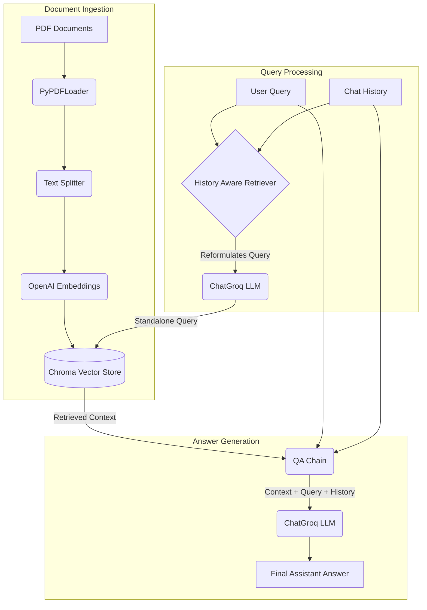

# Conversational RAG with PDF Uploads and Chat History

This is a Streamlit-based web application that allows users to upload PDF documents and have a conversational chat with their content. It uses Retrieval-Augmented Generation (RAG) to provide accurate answers based on the uploaded documents while maintaining the context of the conversation using chat history.

## Features

- **PDF Document Processing**: Upload multiple PDF files and extract their text content.
- **Conversational Memory**: Remembers past interactions in the current session (via a custom Session ID) to provide context-aware responses.
- **State-of-the-art LLMs**: Powered by **Groq** (`llama-3.1-8b-instant`) for extremely fast and accurate generation.
- **High-Quality Embeddings**: Uses **OpenAI Embeddings** to convert text chunks into vector representations.
- **Vector Database**: Utilizes **ChromaDB** for efficient storage and retrieval of document chunks.

## System Architecture

The application follows a standard Conversational Retrieval-Augmented Generation (RAG) architecture:



### Workflow
1. **Document Ingestion**: Uploaded PDFs are parsed, split into manageable chunks, converted into vector embeddings via OpenAI, and stored in a local ChromaDB vector store.
2. **Contextualizing Queries**: When a user asks a question, the system looks at the current chat history and the new question. It uses the Groq LLM to rewrite the question into a "standalone" query that makes sense without needing the history.
3. **Retrieval**: The standalone query is used to search the ChromaDB vector store for the most relevant document chunks.
4. **Answer Generation**: The original question, the chat history, and the retrieved chunks (context) are fed into the Groq LLM to generate a concise, accurate answer.

## Prerequisites

Before running the application, you'll need API keys for the services used:

1. **Groq API Key**: You can get one from the [Groq Console](https://console.groq.com/).
2. **OpenAI API Key**: Required for the OpenAI embeddings. You can get one from the [OpenAI Platform](https://platform.openai.com/).

## Installation

1. **Clone the repository**:
   ```bash
   git clone https://github.com/soham04mehra/rag_chatbot-.git
   cd rag_chatbot-
   ```

2. **Set up a virtual environment** (recommended):
   ```bash
   python -m venv rag_env
   source rag_env/bin/activate  # On Windows use: rag_env\Scripts\activate
   ```

3. **Install the required dependencies**:
   ```bash
   pip install streamlit langchain langchain-core langchain-community langchain-groq langchain-openai langchain-text-splitters chromadb pypdf python-dotenv
   ```

4. **Environment Variables**:
   Create a `.env` file in the root directory and add your OpenAI API Key (and optionally your Groq API key):
   ```env
   OPENAI_API_KEY=your_openai_api_key_here
   GROQ_API_KEY=your_groq_api_key_here
   ```

## How to Run

Start the Streamlit application by running the following command in your terminal:

```bash
streamlit run app.py
```

## Usage

1. Open the local URL provided by Streamlit in your browser (usually `http://localhost:8501`).
2. Enter your **Groq API Key** in the sidebar or main screen (if it's not already loaded from the `.env` file).
3. Specify a **Session ID** to keep track of your specific chat session.
4. **Upload one or multiple PDF files** using the file uploader.
5. Once the PDFs are processed, you can start typing your questions in the chat input.
6. The assistant will retrieve relevant information from the PDFs and answer your questions concisely, remembering the context of your ongoing conversation!

## Technologies Used

- [Streamlit](https://streamlit.io/) - Frontend framework
- [LangChain](https://www.langchain.com/) - LLM orchestration framework
- [Groq](https://groq.com/) - Fast LLM inference
- [OpenAI](https://openai.com/) - Text Embeddings
- [Chroma](https://www.trychroma.com/) - Vector Store
